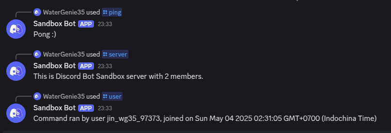

# Discord Bot Sandbox with JavaScript

## 1. Demo Features

### 1.1. Basic Utilities

[]()

## 2. Usage

### 2.1. Run

```bash
npm run start-pm2
npm run stop-pm2
```

### 2.2. Development

#### 2.2.1. Outline

`BotClient` extends `discord.js`'s `Client` and contains:

 - App command-related properties
 - Drizzle db client

 The client dynamically loads discord commands and events from their respective directories.

#### 2.2.2. Commands/Workflow

##### Main Development Loop
```bash
npm run build
npm run test
npm run start
```

##### Working with Database
```bash
npm run clear-db
npx drizzle-kit generate
npx drizzle-kit migrate
npx drizzle-kit studio
```

##### Working with Discord
```bash
npm run script deploy-commands  # then refresh discord
```


## 3. References

- [Discord Developers Documentation](https://discord.com/developers/docs/intro)
- [Discord.js](https://discord.js.org/)
- [Drizzle](https://orm.drizzle.team/)
- [Express](https://expressjs.com/)
